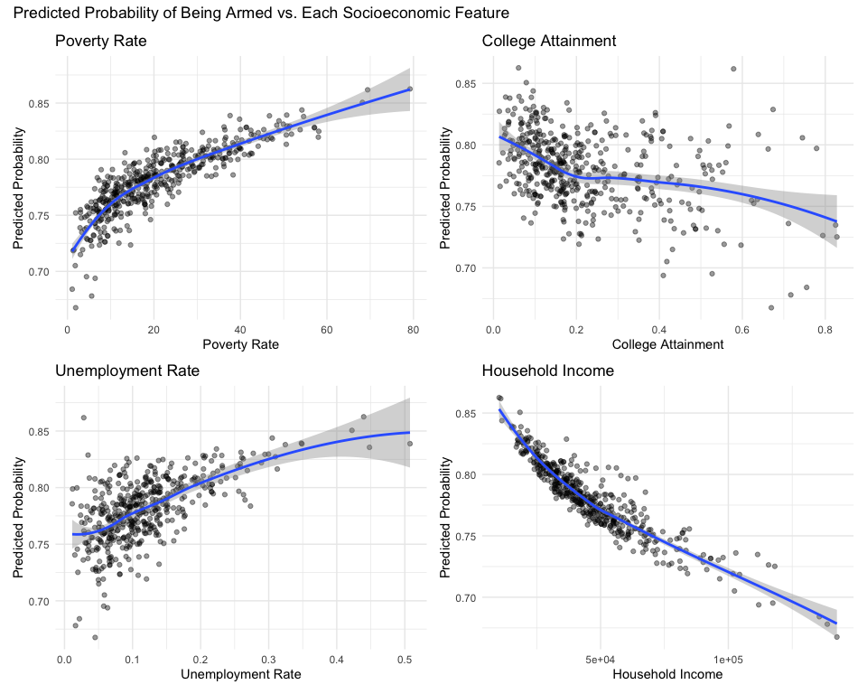
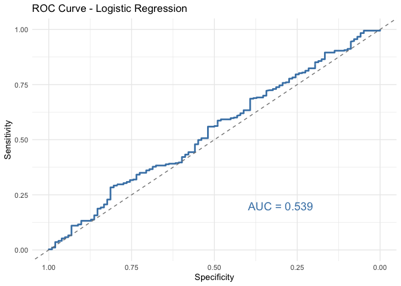
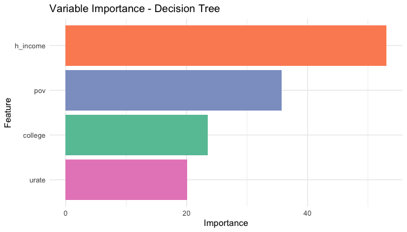
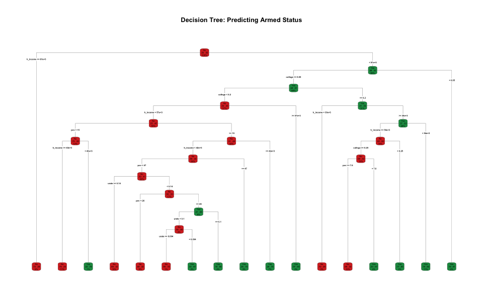

```{r setup, include=FALSE}
knitr::opts_chunk$set(echo = FALSE, warning = FALSE, message = FALSE)
library(tidyverse)
library(janitor)
library(pROC)
library(caret)
library(rpart)
library(rpart.plot)
library(themis)
library(recipes)
library(patchwork)
library(knitr)
```

# INTRODUCTION

AFTER WORKING WITH THE DATA AND DISCUSSING THE INFORMATION WITH YOUR GROUP, YOU SHOULD DESCRIBE 2 QUESTIONS THAT ARE CREATIVE AND INNOVATIVE. YOU SHOULD EXPLAIN WHY THESE QUESTIONS ARE INTERESTING AND WHY THEY DESERVE FURTHER INVESTIGATION. I ADVISE TO THINK OF REASONS WHY AN OWNER OF THE DATA MIGHT BENEFIT FROM ANSWERS TO THESE QUESTIONS. THINK OF REASONS WHY THE WORLD MAY BE INTERESTED IN THESE QUESITONS. THE PURPOSE OF THE INTRODUCTION IS TO STATE SOME INTERESTING QUESTIONS AND DEFEND THE VALUE OF THESE QUESTIONS. THIS INTRODUCTION SHOULD BE WRITTEN IN A WAY THAT SHOULD GET THE READER EXCITED ABOUT SEEING YOUR RESULTS. THIS SHOULD BE WRITTEN IN NO MORE THAN 4 PARAGRAPHS.

# DATA

IN LESS THAN 6 PARAGRAPHS, YOU SHOULD DESCRIBE THE DATA USED TO ANSWER THE QUESTIONS. YOU SHOULD EXPLAIN WHERE THE DATA ORIGINATED. FOR EXAMPLE, IT IS GOOD TO KNOW WHO COLLECTED THE DATA. JUST BECAUSE THE DATA CAME FROM KAGGLE, DOESN'T MEAN KAGGLE.COM COLLECTED THE DATA. GIVE AN IN-DEPTH DESCRIPTION OF THE SPECIFIC VARIABLES IN THE DATA REQUIRED TO ANSWER YOUR QUESTIONS. YOU SHOULDN'T DISCUSS ALL VARIABLES IN THE DATA IF YOU DIDN'T USE ALL VARIABLES IN THE DATA. YOU SHOULD EXPLAIN WHAT EACH OBSERVATION REPRESENTS (I.E. PEOPLE, SCHOOLS, STATES, CITIES, PATIENTS FROM A SPECIFIC HOSPITAL). WHAT IS THIS A SAMPLE OF? HOW MANY OBSERVATIONS DO YOU HAVE? AFTER READING THIS SECTION, THE READER SHOULD CLEARLY UNDERSTAND THE SOURCE AND CONTENT OF THE DATA YOU PLAN ON UTILIZING TO ANSWER YOUR QUESTIONS THAT YOU PROPOSED IN THE INTRODUCTION. AT LEAST ONE, DESCRIPTIVE TABLE AND AT LEAST ONE FIGURE SHOULD BE USED HERE TO HELP THE READER UNDERSTAND WHAT THE DATA LOOKS LIKE WITHOUT SEEING THE ENTIRE DATASET. IN ALL FIGURES AND TABLES, ONLY THE VARIABLES OF INTEREST SHOULD BE USED.

# RESULTS

## Question 2: Can neighborhood socioeconomic features predict whether a victim was armed?

Before fitting any models, we first fit a simple logistic regression on the original data (without any resampling) to get a preliminary sense of whether any of the four variables showed a meaningful trend. The plots below show the relationship between each variable and the predicted probability of being armed, with a LOESS smooth curve to highlight the overall direction. Higher poverty rates and higher unemployment rates are associated with a slightly higher predicted probability of being armed, while higher household income and higher college attainment are associated with a slightly lower probability. The trends are not dramatic, but they are consistent enough in direction that these variables seemed worth exploring further in a more careful modeling setup.

```{r plot-scatter, fig.cap="Figure 1: Predicted Probability of Being Armed vs. Each Socioeconomic Feature"}

```

One issue we ran into right away was that the outcome variable was pretty imbalanced — about 78% of victims were recorded as armed, and only about 22% were not. Training a model on data like this can cause it to just predict "Yes" for almost everything, which is not very useful. To deal with this, we used SMOTE (Synthetic Minority Oversampling Technique) to generate additional synthetic samples for the "not armed" group before training, so both classes were equally represented in the training data. We then fit two models — a logistic regression and a decision tree — both trained on the SMOTE-balanced data and evaluated on a held-out test set.

The logistic regression model did not perform very well. Its AUC came out to 0.539, which is only slightly above 0.5 — basically just above what you would expect from random guessing. Looking at the ROC curve below, it barely rises above the diagonal, which reflects that the model is struggling to separate the two classes. Its accuracy was 0.484, and sensitivity was only 0.463, meaning the model correctly identified less than half of the armed victims. None of the four predictors were statistically significant, which suggests that these neighborhood-level variables on their own do not carry much signal for predicting whether someone was armed.

```{r plot-roc, fig.cap="Figure 2: ROC Curve for Logistic Regression (AUC = 0.539)"}

```

The decision tree did better, with an AUC of 0.740, an accuracy of 0.684, and a specificity of 0.765. Its variable importance plot shows that household income contributed the most to the splits, followed by poverty rate, college attainment, and unemployment rate. This suggests that income and poverty carry a bit more signal than the other two features. The tree diagram gives a clearer picture of how the model actually makes decisions — starting from the root, it first splits on household income, then works down through combinations of the four variables to classify each observation. This kind of threshold-based structure is more intuitive to interpret than a set of regression coefficients.

```{r plot-varimp, fig.cap="Figure 3: Variable Importance for Decision Tree"}

```

```{r plot-tree, fig.cap="Figure 4: Decision Tree Structure for Predicting Armed Status"}

```

Looking at both models together, the decision tree outperformed logistic regression by a reasonable margin. One likely reason for this is that logistic regression assumes a linear relationship between each predictor and the outcome. If the true relationship is non-linear — for example, if poverty rate only starts to matter above a certain threshold — logistic regression will miss that. A decision tree splits the data based on specific cutoff values and can capture those kinds of threshold effects more naturally. It can also pick up on interactions between variables without us having to specify them explicitly. That said, neither model was particularly convincing overall. The table below summarizes the key metrics for both. It still seems like neighborhood socioeconomic features do not tell us very much about whether an individual victim was armed, and whether someone carries a weapon is probably more connected to personal circumstances or the specific situation at the time rather than what the surrounding neighborhood looks like economically.

```{r model-comparison-table}
comparison <- data.frame(
  Model         = c("Logistic Regression", "Decision Tree"),
  Training_Data = c("SMOTE-balanced", "SMOTE-balanced"),
  Accuracy      = c(0.484, 0.684),
  Sensitivity   = c(0.463, 0.661),
  Specificity   = c(0.559, 0.765),
  AUC           = c(0.539, 0.740)
)

kable(comparison, caption = "Table 1: Model Performance Comparison (evaluated on test set)")
```

# CONCLUSION

IN LESS THAN 4 PARAGRAPHS, YOU SHOULD RESTATE YOUR QUESTIONS ALONG WITH YOUR CONCLUSIONS. THE PURPOSE OF THIS SECTION IS TO SUMMARIZE YOUR FINDINGS (SHORT), DEFEND THE IMPORTANCE OF YOUR RESULTS IN THE REAL WORLD (LONG), AND PROVIDE A ROADMAP FOR OTHERS TO CONTINUE THIS WORK (LONG). ARE YOUR CONCLUSIONS WHAT YOU EXPECTED OR UNUSUAL? WHY SHOULD SOMEONE CARE ABOUT THESE RESULTS? HOW COULD THESE RESULTS BE USED IN THE REAL WORLD? YOU SHOULD PROVIDE IDEAS ABOUT FUTURE DIRECTIONS ON WHERE YOUR MODELING COULD POSSIBLY BE IMPROVED. ARE THERE ANY METHODS YOU DIDN'T USE THAT MAY WORK BETTER? IS THERE DATA YOU DIDN'T HAVE ACCESS TO THAT MAY BE USEFUL IN THIS DATA ANALYSIS?
